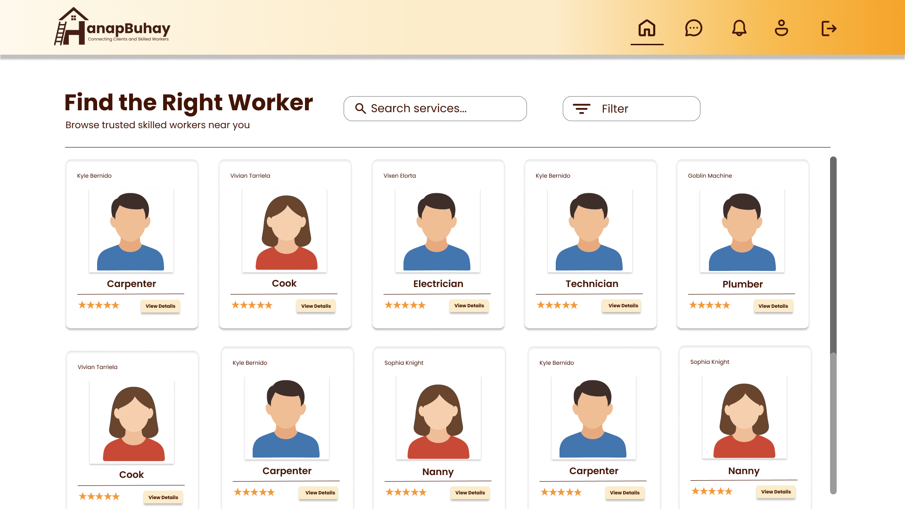
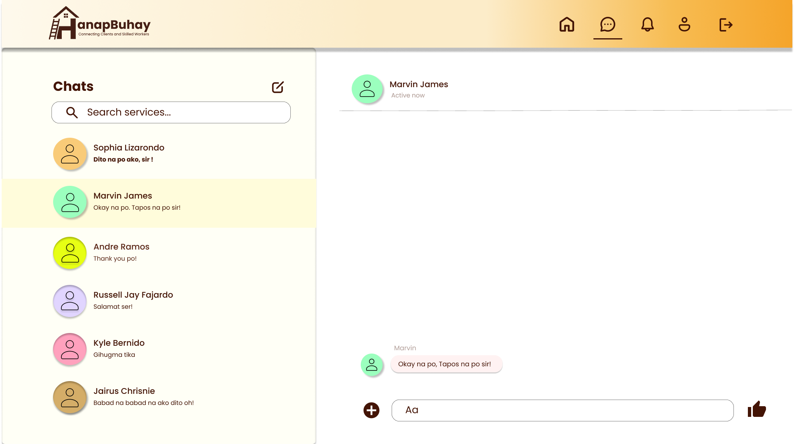

Got it! I can make it sound **more natural, human-written, and “GitHub-friendly”**—like something a student team would write, not an AI-generated corporate tone. Here’s a polished version you can paste:

---

# HanapBuhay: Connecting Clients and Skilled Workers


---

## Table of Contents

* [About the Project](#about-the-project)
* [Features](#features)
* [Users](#users)
* [Technologies](#technologies)
* [Screenshots](#screenshots)
* [Setup](#setup)
* [How to Use](#how-to-use)
* [Contributing](#contributing)
* [Risks & Assumptions](#risks--assumptions)
* [License](#license)
* [References](#references)

---

## About the Project

**HanapBuhay** is a web app that makes it easy for clients to find skilled workers—like plumbers, carpenters, electricians, tutors, or house helpers—in San Juan City, Philippines.

Traditionally, finding these workers relies on word-of-mouth, flyers, or social media posts, which can be unreliable and inconsistent. Our app gives workers a platform to showcase their skills, build reputation, and get consistent jobs, while clients can quickly find and trust someone for the job they need.

---

## Features

### For Clients

* Sign up/login with email verification
* Search and filter skilled workers by service type or location
* Chat with workers in real time
* Leave ratings and reviews after the job is done

### For Skilled Workers

* Create and manage service profiles
* Accept or reject job requests
* Communicate with clients through messaging

### For Admins

* Monitor users and manage accounts
* Ensure platform integrity and trustworthiness

---

## Users

| Role           | Who                             | What They Can Do                                             |
| -------------- | ------------------------------- | ------------------------------------------------------------ |
| Client         | Homeowners, tenants             | Register/login, browse workers, send requests, leave ratings |
| Skilled Worker | Plumber, Carpenter, Electrician, ... | Create profiles, post services, respond to jobs, chat        |
| Admin          | Platform Admin                  | Manage users, monitor activities, maintain trust             |

---

## Technologies

* **Frontend:** HTML, CSS
* **Backend:** JavaScript, C#, ASP.NET
* **Database:** Microsoft SQL Server

---

## Screenshots

**Homepage:**
**Homepage (Client Page):**


**Worker Profile Page:**


**Messaging System:**


**Admin Dashboard:**


---

## Setup

### Requirements

* [.NET Framework](https://dotnet.microsoft.com/)
* [Visual Studio](https://visualstudio.microsoft.com/)
* [Microsoft SQL Server](https://www.microsoft.com/en-us/sql-server/sql-server-downloads)

### Steps

1. Clone the repo:

```bash
git clone https://github.com/yourusername/hanapbuhay.git
```

2. Set up the SQL Server database and update the connection strings.
3. Open the solution in Visual Studio.
4. Build and run the backend server.
5. Open the frontend in a browser at `http://localhost:5000` (or your configured port).

---

## How to Use

* **Clients:** Sign up, search for services, send job requests, and leave reviews.
* **Workers:** Sign up, create profiles, accept/reject jobs, and message clients.
* **Admins:** Manage users and monitor platform activities.

---

## Contributing

We welcome contributions!

1. Fork the repository
2. Create a branch for your feature:

```bash
git checkout -b feature/YourFeatureName
```

3. Make your changes and commit:

```bash
git commit -m "Add feature: YourFeatureName"
```

4. Push to your branch:

```bash
git push origin feature/YourFeatureName
```

5. Open a pull request

---

## Risks & Assumptions

**Assumptions:**

* Users have stable internet
* Workers keep profiles updated
* Clients leave honest reviews

**Risks:**

* Fake profiles or misleading info
* Connectivity issues may affect usage
* Data privacy/security risks
* Disputes may affect user trust

---

## License

This project is licensed under MIT. See the [LICENSE](LICENSE) file.

---

## References

* International Labour Organization. *Background Paper on the Informal Sector in the Philippines.* ILO, Metro Manila.
* Soriano, C. R., Cabalquinto, E., & Panaligan, J. H. (2021). *Performing “Digital Labor Bayanihan”*. Sociologias, 23(57), 84–111.
* Bayudan-Dacuycuy, C., Orbeta, A. C. Jr., Serafica, R. B., & Baje, L. K. C. (2020). *Towards a Sustainable Online Work in the Philippines.* PIDS.
* Habacon, J. P. P. (2019). *Buhay Kasambahay: Experiences of Female Domestic Workers in Los Baños, Laguna.* LPU-Laguna Journal of Multidisciplinary Research.
